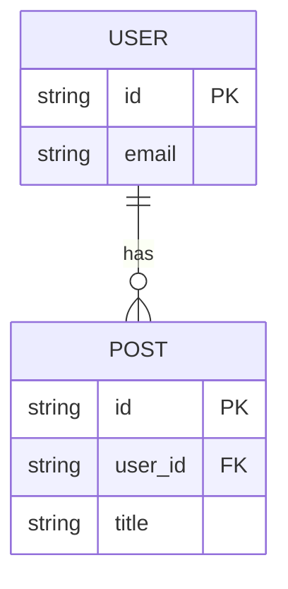

# データベース設計 (Schema Design)

## 1. ER図 (Entity Relationship)
<!--
テーブル間のリレーションシップを図示する。
-->

## 2. テーブル定義 (Tables)

### Users
- `id` (PK): UUID
- `email`: Varchar(255), Unique
- `created_at`: Component

### [TableName]
- `id` (PK): 
- ...

## 3. セキュリティ設計 (Security - RLS via Database)
<!-- アプリ層ではなく、DB層で強制するセキュリティポリシーを定義する -->
### User Table
- **Policy**: `auth.uid() == id` (自分自身のデータのみ参照・更新可能)
- **Role**: Authenticated users only

## 4. パフォーマンス戦略 (Performance)
- **Index**: よく検索条件(`WHERE`)や結合(`JOIN`)に使われるカラムを列挙する。
  - `posts(user_id)`: ユーザーごとの投稿一覧取得用
