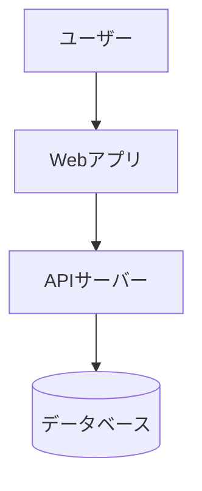

# システムアーキテクチャ (System Architecture)

## 1. 全体構成図 (Context Diagram)
<!--
システムとその外部システム（ユーザー、外部APIなど）との関係を図示する。
AIに「概要を伝えたのでMermaidで描いて」と依頼すると良い。
-->


## 2. 技術スタック詳細 (Tech Stack)
- **Frontend**: 
- **Backend**: 
- **Infrastructure**: 
- **DevTools**: (Linter, TestFW etc.)

## 3. ディレクトリ構成 (Directory Structure)
<!--
これから作成するリポジトリの主要なフォルダ構成案。
-->
```
src/
  ├── components/
  ├── features/
  ├── lib/
  └── pages/
```

## 4. 外部連携・依存関係
- **Auth Provider**: (Firebase Auth, Auth0 etc.)
- **External APIs**: 
